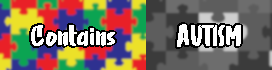

This code runs **byond://ss13.soyjak.st:8888**

| Website                 | Link                                           |
|-------------------------|------------------------------------------------|
| Website                 | [https://soyjak.st/ss/](https://soyjak.st/ss/) |
| Code | https://github.com/Space-Soyentists/ShartyStation13 |
| Wiki                    | [https://wiki.soyjak.st/](https://wiki.soyjak.st/) |
| Codedocs                | [https://codedocs.tgstation13.org/](https://codedocs.tgstation13.org/) |

This is the codebase for the soicaca-flavored fork of Space Station 13. This repo is keyed off of the Monkestation codebase, this is a custom fork of that repo intended for use on our server, but feel free to host it if you'd like.

Space Station 13 is an open-source tile-based A24 slowburn autistic role-playing video game created in 2003 by Exadv1, originally supposed to be an atmospheric simulator. It is now collectively maintained by its community and runs on the shitty freeware game engine BYOND, made sometime in 1996. SS13 dwarfs the other shitty Dragon Ball roleplay games on BYOND by thousands of players, which would have likely died in 2014 if it were not for SS13 singlehandedly keeping the entire platform alive. 

## DOWNLOADING

[Downloading](.github/guides/DOWNLOADING.md)

[Running on the server](.github/guides/RUNNING_A_SERVER.md)

[Maps and Away Missions](.github/guides/MAPS_AND_AWAY_MISSIONS.md)

**Building tgstation in DreamMaker directly is now deprecated and might produce errors**, such as `'tgui.bundle.js': cannot find file`.

## LICENSE

All code after [commit 6c53bfa00a05828640231236c577136d687be508 on 2025-10-14 at 11:14 PM CST](https://github.com/Space-Soyentists/ShartyStation13/commit/2c74e3f1b25c18db04ec6487fadfbc861698103b) is under a modified version of the AGPLV3 license which contains the soyjak.party© license at the top, which states that all further redistributed substantial copies of this software will include ASCII art of a [Soyjak](https://en.wikipedia.org/wiki/Wojak#Soyjak).

See [LICENSE](LICENSE) and [GPLv3.txt](GPLv3.txt) for more details.

---

The TGS DMAPI is licensed as a subproject under the MIT license.

See the footer of [code/__DEFINES/tgs.dm](./code/__DEFINES/tgs.dm) and [code/modules/tgs/LICENSE](./code/modules/tgs/LICENSE) for the MIT license.

---

All assets, including icons and sound, are under a [Creative Commons 3.0 BY-SA license](https://creativecommons.org/licenses/by-sa/3.0/) unless otherwise indicated.

^wordswordswords everything is apart of der bibisi license which means no ytbois
